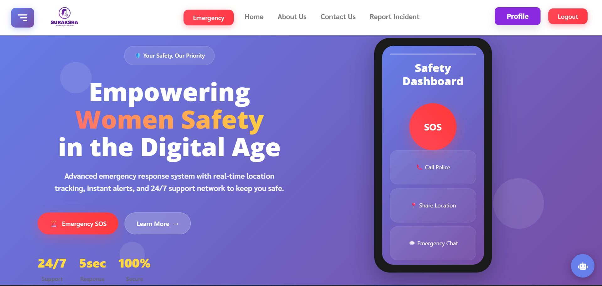

# 🛡️ Suraksha – Advanced Women Safety Web Application

<div align="center">



**Suraksha is a smart, real-time women's safety platform designed to provide immediate emergency assistance through SOS alerts, live location tracking, SMS & Email notifications, and trusted contact communication.**

*Built for safety, speed, and reliability — Suraksha helps women get timely support during critical situations.*

[](https://opensource.org/licenses/MIT)
[](https://nodejs.org/)
[](https://reactjs.org/)
[](https://mongodb.com/)

</div>

---

## 🚨 Key Features

### 🔴 Emergency SOS System
- **One-tap emergency trigger** - Instant distress signal activation
- **Dual alert system** - SMS + Email notifications to trusted contacts
- **Auto-location sharing** - GPS coordinates with Google Maps link
- **Background operation** - Works even when app is minimized

### 📍 Real-Time Location Tracking
- Live GPS coordinate fetching
- Google Maps integration for responders
- Continuous location updates during emergency mode
- Offline location caching for poor network areas

### 📤 Multi-Channel Alert System
- ✅ **SMS Alerts** to saved emergency contacts
- ✅ **Email Alerts** with detailed incident information
- ✅ **Push Notifications** for immediate attention
- ✅ Support for multiple emergency contacts

### 🗣️ Voice Command Activation
- Hands-free SOS triggering via voice commands
- Useful in restricted or dangerous situations
- Voice recognition for emergency phrases

### 📊 Incident Reporting Module
- Comprehensive incident documentation
- Secure report storage with encryption
- Evidence collection (photos, videos, audio)
- Analytics dashboard for safety insights

### 👥 Trusted Contacts Management
- Add, edit, and delete emergency contacts
- Contact verification system
- Instant alert distribution to all registered contacts
- Contact priority levels

### 📚 Safety Resources Hub
- Verified women's safety guidelines
- Emergency helpline numbers (India-specific)
- Self-defense tutorials and tips
- Safety awareness content

### 📱 Modern User Experience
- **Mobile-first responsive design**
- **Progressive Web App (PWA)** capabilities
- **Offline functionality** for critical features
- **Accessibility compliant** interface
- **Dark/Light mode** support

---

## 🖥️ Tech Stack

### Frontend
- **React.js** - Modern UI framework
- **HTML5 & CSS3** - Semantic markup and styling
- **Bootstrap** - Responsive design framework
- **JavaScript ES6+** - Interactive functionality

### Backend
- **Node.js** - Server runtime environment
- **Express.js** - Web application framework
- **MongoDB** - NoSQL database for scalability
- **Mongoose** - MongoDB object modeling

### APIs & Services
- **Geolocation API** - Real-time location tracking
- **Email Service** - SMTP/SendGrid for email alerts
- **SMS API** - Fast2SMS/Twilio for SMS notifications
- **Google Maps API** - Location visualization
- **AWS S3** - Secure media file storage

### Security & Performance
- **JWT Authentication** - Secure user sessions
- **bcrypt** - Password hashing
- **Rate Limiting** - API protection
- **CORS** - Cross-origin resource sharing
- **Helmet.js** - Security headers

---

## 📁 Project Structure

```
Suraksha/
├── client/                     # React frontend
│   ├── public/
│   ├── src/
│   │   ├── Components/         # Reusable UI components
│   │   ├── pages/             # Application pages
│   │   ├── context/           # React context for state management
│   │   ├── styles/            # CSS stylesheets
│   │   └── images/            # Static assets
│   └── package.json
├── server/                     # Node.js backend
│   ├── controllers/           # Business logic
│   ├── models/               # Database schemas
│   ├── routes/               # API endpoints
│   ├── middlewares/          # Custom middleware
│   ├── utils/                # Helper functions
│   └── package.json
└── README.md
```

---

## ⚙️ Setup & Installation

### Prerequisites
- Node.js (v16 or higher)
- MongoDB (v5 or higher)
- Git

### 1. Clone the Repository
```bash
git clone https://github.com/Slacky300/WomenSafetyHackathonApp.git
cd WomenSafetyHackathonApp
```

### 2. Install Dependencies

**Backend Setup:**
```bash
cd server
npm install
```

**Frontend Setup:**
```bash
cd ../client
npm install
```

### 3. Environment Configuration

Create `.env` files in both server and client directories:

**Server `.env`:**
```env
# Database
MONGODB_URI=mongodb://localhost:27017/suraksha

# JWT
JWT_SECRET=your_jwt_secret_key

# Email Configuration
EMAIL_USER=your_email@gmail.com
EMAIL_PASS=your_app_password

# SMS API
SMS_API_KEY=your_sms_api_key
SMS_SENDER_ID=your_sender_id

# AWS S3 (Optional)
AWS_ACCESS_KEY_ID=your_aws_access_key
AWS_SECRET_ACCESS_KEY=your_aws_secret_key
AWS_BUCKET_NAME=your_s3_bucket_name

# Server Configuration
PORT=5000
NODE_ENV=development
```

**Client `.env`:**
```env
REACT_APP_API_URL=http://localhost:5000/api
REACT_APP_GOOGLE_MAPS_API_KEY=your_google_maps_api_key
```

### 4. Database Setup
```bash
# Start MongoDB service
mongod

# Create database (automatic on first connection)
```

### 5. Run the Application

**Start Backend Server:**
```bash
cd server
npm start
```

**Start Frontend Development Server:**
```bash
cd client
npm start
```

### 6. Access the Application
- **Frontend:** http://localhost:3000
- **Backend API:** http://localhost:5000
- **Admin Panel:** http://localhost:3000/admin

---

## 🌐 Deployment Options

### Frontend Deployment
- **Vercel** - Recommended for React apps
- **Netlify** - Easy continuous deployment
- **GitHub Pages** - Free static hosting
- **AWS S3 + CloudFront** - Scalable solution

### Backend Deployment
- **Railway** - Modern deployment platform
- **Render** - Free tier available
- **Heroku** - Traditional PaaS
- **AWS EC2** - Full control VPS
- **DigitalOcean** - Developer-friendly cloud

### Database Hosting
- **MongoDB Atlas** - Managed MongoDB service
- **AWS DocumentDB** - MongoDB-compatible
- **Local MongoDB** - Development environment

---

## 🧪 Testing & Validation

### Manual Testing Checklist
- [ ] SMS delivery functionality
- [ ] Email alert system
- [ ] GPS location accuracy
- [ ] Contact registration/management
- [ ] Voice command activation
- [ ] UI responsiveness across devices
- [ ] Emergency button functionality
- [ ] Incident report submission
- [ ] Admin panel access

### Automated Testing
```bash
# Run backend tests
cd server
npm test

# Run frontend tests
cd client
npm test
```

---

## 🔒 Security Features

- **End-to-end encryption** for sensitive data
- **Secure authentication** with JWT tokens
- **Input validation** and sanitization
- **Rate limiting** to prevent abuse
- **HTTPS enforcement** in production
- **Data privacy compliance** (GDPR ready)

---

## 📱 Mobile App Features

- **Progressive Web App (PWA)** capabilities
- **Offline functionality** for critical features
- **Push notifications** support
- **App-like experience** on mobile devices
- **Home screen installation** option

---

## 🤝 Contributing

We welcome contributions to enhance women's safety solutions!

### How to Contribute:
1. Fork the repository
2. Create a feature branch (`git checkout -b feature/AmazingFeature`)
3. Commit your changes (`git commit -m 'Add some AmazingFeature'`)
4. Push to the branch (`git push origin feature/AmazingFeature`)
5. Open a Pull Request

### Areas for Contribution:
- 🎨 UI/UX improvements
- 🔒 Security enhancements
- 📱 Mobile app development
- 🌐 Internationalization
- 🧪 Testing coverage
- 📚 Documentation

---

## 📞 Emergency Helplines (India)

| Service | Number | Available |
|---------|--------|-----------|
| Women Helpline | **1091** | 24/7 |
| Police Emergency | **100** | 24/7 |
| National Emergency | **112** | 24/7 |
| Women Safety | **181** | 24/7 |
| Cyber Crime | **1930** | 24/7 |

---

## 📜 License

This project is licensed under the **MIT License** - see the [LICENSE](LICENSE) file for details.

---

## 🙏 Acknowledgements

- **API Providers** - SMS and Email service providers
- **Open Source Community** - For amazing libraries and tools
- **Safety Advocates** - For guidance on women's safety features
- **Beta Testers** - For valuable feedback and testing
- **Hackathon Mentors** - For technical guidance and support

---

## 📧 Contact & Support

- **Email:** support@suraksha-app.com
- **GitHub Issues:** [Report a Bug](https://github.com/Slacky300/WomenSafetyHackathonApp/issues)
- **Documentation:** [Wiki](https://github.com/Slacky300/WomenSafetyHackathonApp/wiki)

---

<div align="center">

**Made with ❤️ for Women's Safety**

*Empowering women through technology, one alert at a time.*

[](https://github.com/Slacky300/WomenSafetyHackathonApp)
[](https://github.com/Slacky300/WomenSafetyHackathonApp/fork)

</div>